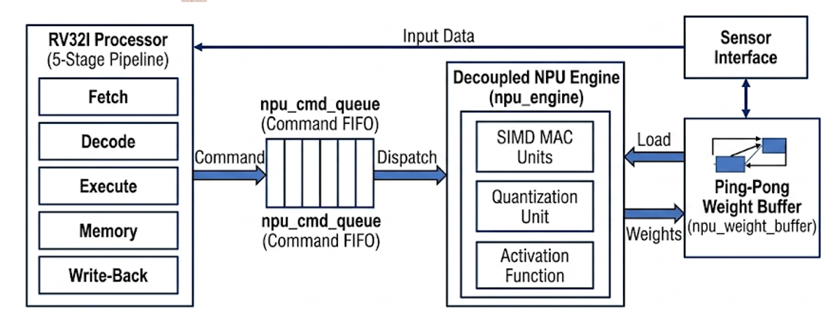
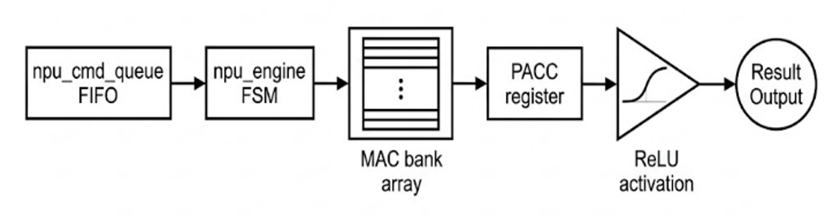
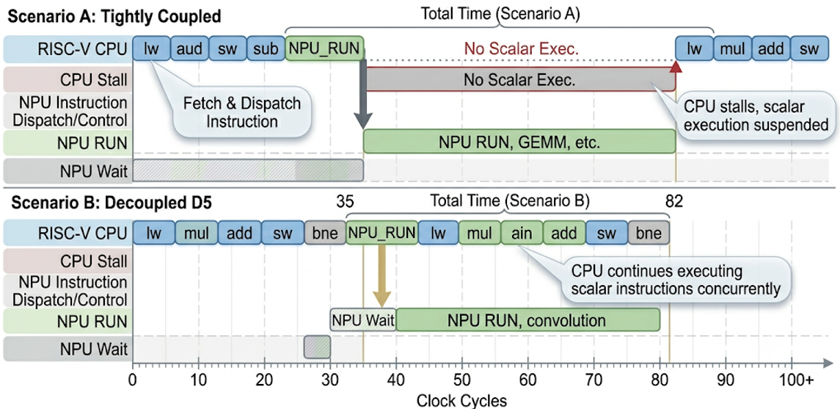

# Architecture

This directory contains the architectural diagrams of the RV-NPU design.

## System Architecture

The overall RV-NPU architecture combines a 32-bit RV32I processor with a
decoupled Neural Processing Unit and command-queue-based neural dispatch.

## NPU Microarchitecture

The NPU microarchitecture shows the command queue, neural execution control,
SIMD MAC array, PACC, and ReLU activation path.

## CPU-NPU Execution

This diagram illustrates the difference between tightly coupled and
decoupled CPU-NPU execution, highlighting the ability of the CPU to continue
scalar execution while the NPU performs neural computation.

