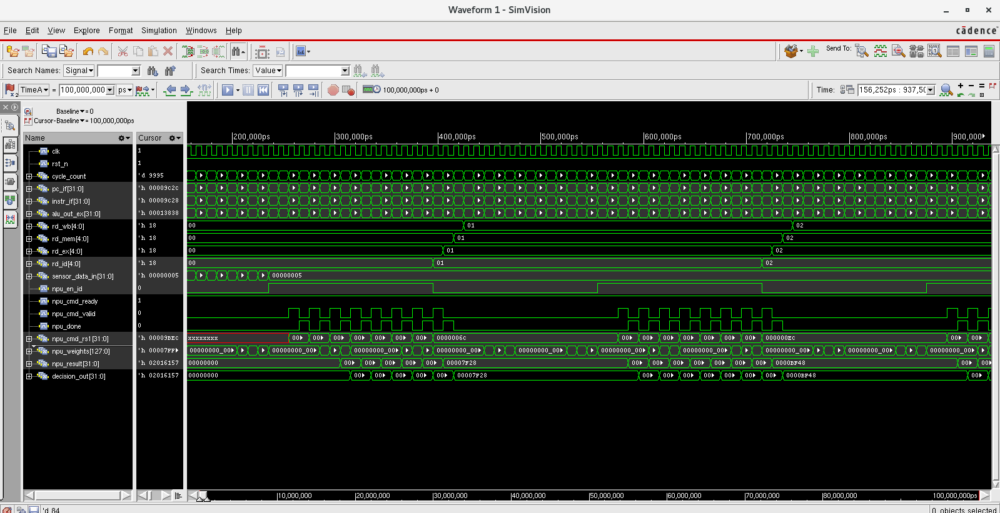
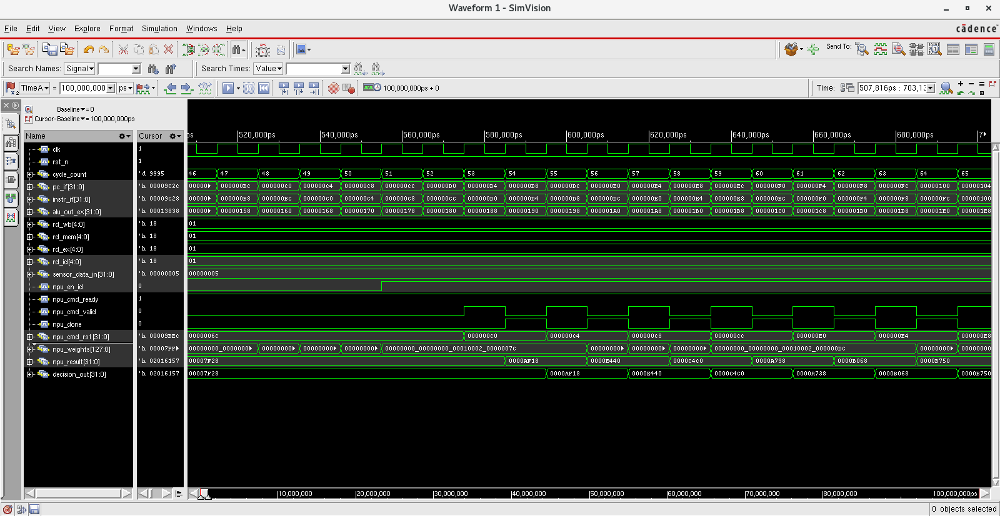
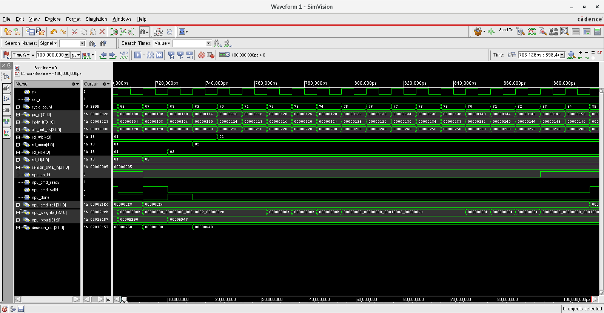

# Simulation

This directory contains the Verilog RTL, testbench, and Cadence SimVision
waveforms used for functional verification of the RV-NPU architecture.

The simulation demonstrates the key feature of the design: **decoupled
CPU-NPU execution**, where the CPU continues executing scalar instructions
while the NPU independently performs neural computation when a neural
operation is requested.

## Simulation Environment

- **HDL:** Verilog
- **Simulator:** Cadence NCsim
- **Waveform Viewer:** Cadence SimVision

## Files

| File | Description |
|---|---|
| `rv_npu_D6.v` | Verilog RTL design |
| `rv_npu_tb.v` | Verilog testbench |
| `waveform_full.png` | Complete simulation waveform |
| `waveform_npu_enable.png` | Zoomed view of NPU-enabled execution |
| `waveform_npu_disable.png` | Zoomed view of NPU-disabled execution |

## Decoupled CPU-NPU Execution

The RV-NPU architecture separates scalar CPU execution from neural
processing.

The CPU remains active during normal execution. When a neural operation is
requested, the NPU is enabled and performs the neural computation
independently while the CPU continues executing its own scalar instructions.

This allows CPU and NPU activity to overlap rather than forcing the CPU to
halt while waiting for neural computation.

The simulation waveforms show this behavior through signals including:

- `npu_en_id`
- `npu_cmd_ready`
- `npu_cmd_valid`
- `npu_done`
- `npu_cmd_rs1`
- `npu_weights`
- `npu_result`
- `decision_out`

## Simulation Results

### Complete Simulation

The complete waveform provides an overview of processor execution and NPU
activity across the simulation interval.

### NPU Enabled

This zoomed waveform highlights the interval in which the NPU is enabled for
neural processing.

During this interval, NPU control and data signals become active while the
CPU continues its execution. This demonstrates the intended decoupled
CPU-NPU operation.

### NPU Disabled

This zoomed waveform highlights an interval in which the NPU is not enabled
for neural processing.

The CPU continues normal scalar execution while the NPU remains inactive.

## Verification Scope

The simulation is used to observe:

- RV32I processor execution
- NPU enable and command dispatch
- CPU-NPU decoupled execution
- Neural computation and result generation
- NPU completion signaling
- Processor activity during NPU execution

The simulation provides functional verification of the RTL before proceeding
to synthesis and ASIC physical implementation.
