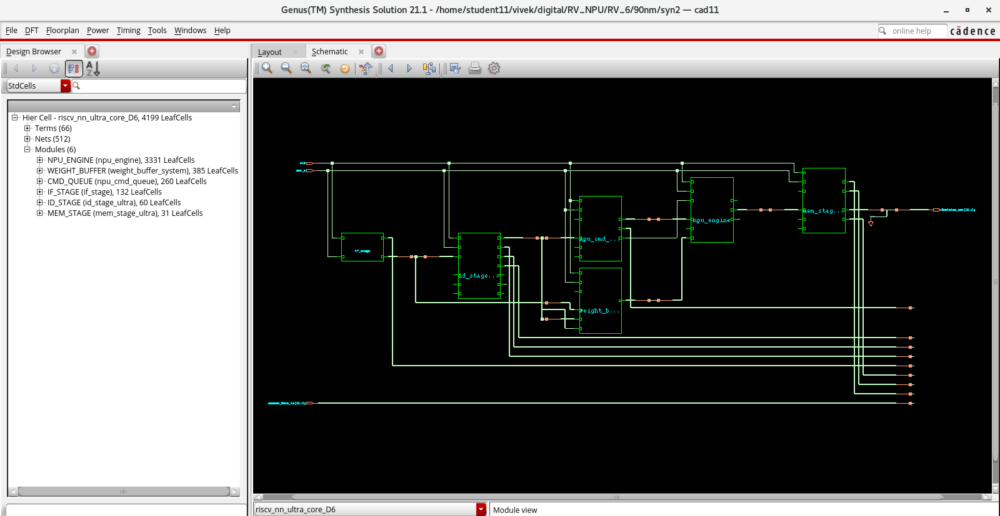

# Synthesis

This directory contains the logic synthesis setup and synthesized design view
of the RV-NPU using Cadence Genus.

The synthesis stage converts the RV-NPU Verilog RTL into a technology-mapped
gate-level implementation and evaluates its area, timing, power, and overall
quality of results before physical design.

## Tool and Technology

- **EDA Tool:** Cadence Genus
- **Technology:** 90 nm standard-cell library
- **HDL:** Verilog
- **Target Frequency:** 100 MHz
- **Clock Period:** 10 ns

## Files

| File | Description |
|---|---|
| `synthesis.tcl` | Genus synthesis and reporting script |
| `constraints.sdc` | Timing and I/O constraints |
| `synthesis_circuit.png` | Synthesized gate-level circuit view |

### `synthesis.tcl`

Cadence Genus Tcl script used to perform the synthesis flow.

The script includes:
- files invoking
- synthesis making commands
- report generation

### `constraints.sdc`

Synopsys Design Constraints used during synthesis.

The constraints include:
- Clock definition
- input / output delay
- load 

## Synthesis Flow

```text
Verilog RTL
     │
     ▼
Technology Library
     │
     ▼
RTL Elaboration
     │
     ▼
SDC Constraints
     │
     ▼
Generic Synthesis
     │
     ▼
Technology Mapping
     │
     ▼
Optimization
     │
     ▼
Area / Timing / Power / QoR
     │
     ▼
Gate-Level Netlist

```

## Synthesized Circuit

The following view shows the synthesized RV-NPU design in Cadence Genus.

The hierarchy includes the processor pipeline stages, command queue,
NPU engine, and weight-buffer system.



## Synthesis Summary
The D6 design was synthesized using the 90 nm standard-cell library.
| Metric | Result |
|---|---:|
| Leaf Cell Count | 4,199 |
| Cell Area | 45,258.835 µm² |
| Sequential Cells | 890 |
| Combinational Cells | 3,309 |
| Timing Slack | +2.425 ns |
| Violating Paths | 0 |
| Total Power | ~4.08 mW |

## Output for Physical Design
The synthesis flow generates the gate-level netlist and SDC used as inputs
for the subsequent Cadence Innovus physical-design flow.
